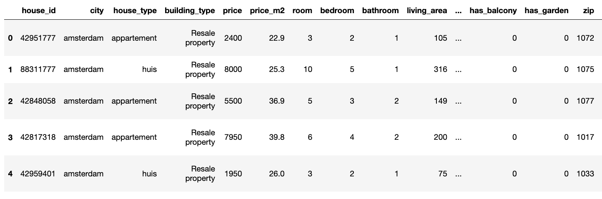

# FundaScraper 🏡

[](https://www.repostatus.org/#active)
[](https://app.travis-ci.com/whchien/funda-scraper)
[](https://codecov.io/gh/whchien/funda-scraper)
[](https://pepy.tech/project/funda-scraper)
[](https://pypi.org/project/funda-scraper/)
[](https://www.python.org/dev/peps/pep-0008/)

`FundaScaper` provides the easiest way to perform web scraping on Funda, the Dutch housing website. You can find houses either for sale or for rent, and access historical data from the past few years.

Please note:

1. Scraping this website is ONLY allowed for personal use (as per Funda's Terms and Conditions).
2. Any commercial use of this Python package is prohibited. The author holds no liability for any misuse of the package.

## Install

### Install with pip:

```
pip install funda-scraper
```

### Clone the repository:

```
git clone https://github.com/whchien/funda-scraper.git
cd funda-scraper
export PYTHONPATH=${PWD}
python funda_scraper/scrape.py --area amsterdam --want_to rent --page_start 1 --number_of_pages 3 --save
```

## Quickstart

```
from funda_scraper import FundaScraper

scraper = FundaScraper(
    area="amsterdam",
    want_to="rent",
    find_past=False,
    page_start=1,
    number_of_pages=3,
    min_price=500,
    max_price=2000
)
df = scraper.run(raw_data=False, save=True, filepath="test.csv")
df.head()
```



- Note for Windows Users: Please add `if __name__ == "__main__":` before your script.

## Customizing Your Scraping

You can pass several arguments to `FundaScraper()` for customized scraping:

- `area`: Specify the city or specific area you want to look for, e.g. Amsterdam, Utrecht, Rotterdam, etc.
- `want_to`: Choose either `buy` or `rent` to find houses either for sale or for rent.
- `find_past`: Set to `True` to find historical data; the default is `False`.
- `page_start`: Indicate which page to start scraping from; the default is `1`.
- `number_of_pages`: Indicate how many pages to scrape; the default is `1`.
- `min_price`: Indicate the lowest budget amount.
- `max_price`: Indicate the highest budget amount.
- `min_floor_area`: Indicate the minimum floor area.
- `max_floor_area`: Indicate the maximum floor area.
- `days_since:`: Specify the maximum number of days since the listing date.
- `property_type`: Specify the desired property type(s).
- `sort`: Specify sorting criteria.

The scraped raw result contains following information:

- url
- price
- address
- description
- listed_since
- zip_code
- size
- year_built
- living_area
- kind_of_house
- building_type
- num_of_rooms
- num_of_bathrooms
- layout
- energy_label
- insulation
- heating
- ownership
- exteriors
- parking
- neighborhood_name
- date_list
- date_sold
- term
- price_sold
- last_ask_price
- last_ask_price_m2
- city

To fetch the data without preprocessing, specify `scraper.run(raw_data=True)`.

_Note_: Information regarding listing dates is no longer available since Q4 2023. Funda requires users to log in to see this information.

## More information

Check the [example notebook](https://colab.research.google.com/drive/1hNzJJRWxD59lrbeDpfY1OUpBz0NktmfW?usp=sharing) for further details. If you find this project helpful, please give it a [star](https://github.com/whchien/funda-scraper).
